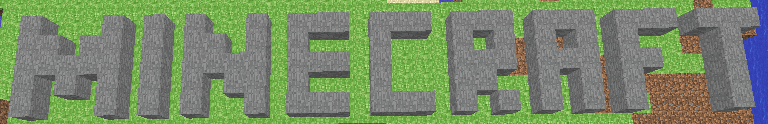
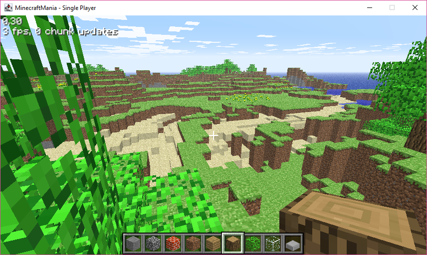
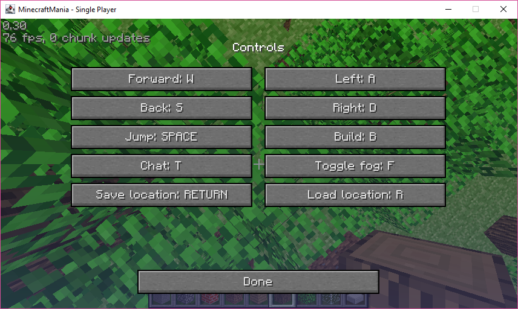
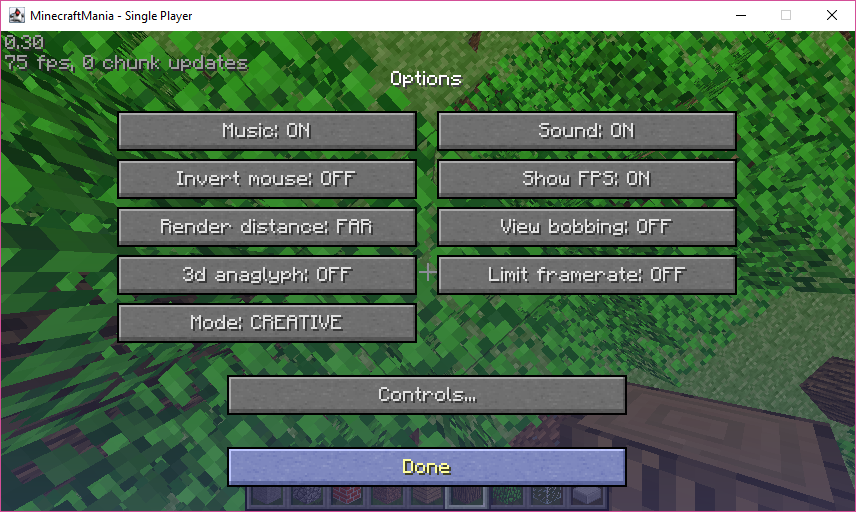
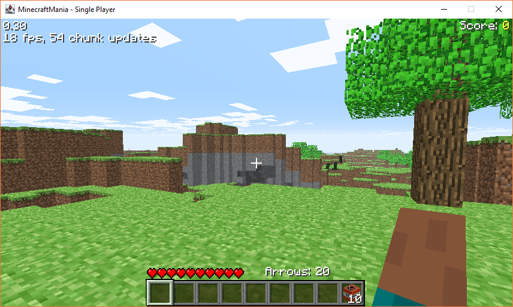

Minecraft Classic Forever
=========================
The Minecraft Classic Forever project brings you the source to Minecraft 0.30 (Classic) along with the latest version of J-OGG!

What is this
============
This repo is a fork of the original Minecraft Classic repo that can be found in GitHub [here](https://github.com/ManiaDevelopment/Minecraft-Classic-Forever).
[Minecraft Classic](https://minecraft.gamepedia.com/Classic) is currently the only free version of Minecraft available out there.
Although the original repo provides the source code of Minecraft Classic, it does not provide build and run scripts that can ease the compilation and run process. 
So one cannot easily run it into a playable game. 


Thie forked repo aims to fill this gap and provides a build script using [gradle](https://gradle.org/) as build tool.
Read on for instructions on how to obtain/download the sources, compile them, run the game and finally play.


Note: You do not need to install gradle.

How to play
===========
Before being able to play, you need to download the source, then compile it and finally run it. See sections below to see how to do that:


Download Sources
================
You need a git command available. Install git from [here](https://git-scm.com/book/en/v2/Getting-Started-Installing-Git).
Once you have git installed, please open a console, go into a directory of your choice and execute the following command: 
```
   git clone https://github.com/ynedelchev/Minecraft-Classic-Forever
```
This will create a sub-directory named `Minecraft-Classic-Forever`. 
Go inside that directory and continue with the compilation.

Compile
=======
In the console run the command: 
```
   ./gradlew clean build 
```
If everything is successfull, you would receive a message saying `BUILD SUCCESSFULL`.
Then you are ready to continue with running the game:

Run
===


Windows
-------
In the console execute the command: 
```
   ./gradlew run
```

Linux/Mac OS X/Solaris
----------------------
Edit the file `build.gradle` and fine the line that says: 
```
 systemProperty "java.library.path", "run/native/windows"
```
change it to 
```
 systemProperty "java.library.path", "run/native/<osname>"
```
where `<osname>` is one of `linux`, `macosx` or `solaris` depending on the operating system of use.
For example, if you are running Linux, then change it to:
```
 systemProperty "java.library.path", "run/native/linux"
```

Then in the console, execute the command:
```
./gradlew run
```

Screenshots
-----------

*Panoramic View in Creative Mode*



*Controls Screen*



*Options Screen*



*Panoramic View in Survival Mode*


License
-------

The original Minecraft Classic source code is Copyright (c) 2009-2012 Mojang AB.
The MinecraftClassicForever source code is licensed under the [MIT License](http://www.opensource.org/licenses/mit-license.html).

See Also
--------
https://code.org/minecraft
